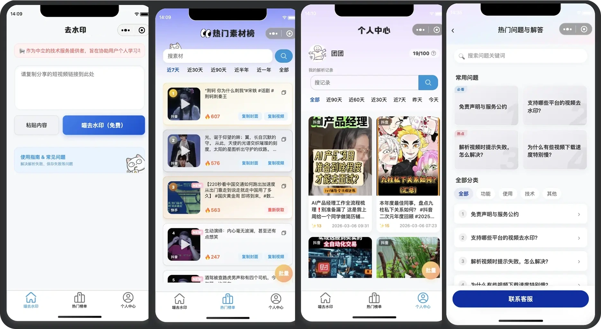

<div align="center">


# 迷你去水印 (mini-parse) 🎬

**多平台短视频去水印微信小程序前端**

[](LICENSE)
[](https://mp.weixin.qq.com/)
[](https://developer.mozilla.org/en-US/docs/Web/JavaScript)
[](https://developers.weixin.qq.com/miniprogram/dev/framework/)
[](https://github.com/ucmao/media-parser)

<p align="center">
<a href="#-核心特性">核心特性</a> •
<a href="#-快速开始">快速开始</a> •
<a href="#-项目结构">项目结构</a> •
<a href="#-联系作者">联系作者</a> •
<a href="#️-开源协议--免责声明">开源协议</a>
</p>

专为创作者打造的素材获取微信小程序，提供高效的短视频解析服务。

支持抖音、快手、小红书等主流平台，通过简洁的交互界面，助你一键获取无水印高清视频。

**后端源码**：[https://github.com/ucmao/media-parser](https://github.com/ucmao/media-parser)（通用小程序解析后端，可供参考）

</div>

---

## ✨ 核心特性

### 📱 界面预览

<p align="center">
  
</p>

### **无损去水印流程**：
* **智能提取**：粘贴分享链接后，前端通过 API 调用后端 `/api/parse` 接口。
* **高清下载**：直接下载 `/api/parse` 返回的媒体地址并保存到系统相册，不依赖旧版 `/api/download` 中转接口。

### **精简且可扩展的代码结构**：
* **核心页面**：包含首页、播放页和可直接使用的问答页。
* **历史模板**：`templates/legacy-pages/` 保留热门榜单与个人中心的历史页面源码，供二次开发参考；这些模板不参与当前小程序构建。
* **无加密门槛**：只使用标准 `wx.request` 请求 `/api/parse`，没有动态签名、加密参数或专有鉴权协议。

---

## 💾 技术栈

| 维度 | 技术选型 | 说明 |
| --- | --- | --- |
| **底层框架** | **微信小程序原生框架** | 确保最佳性能与原生交互体验 |
| **核心语言** | JavaScript, WXML, WXSS | 标准小程序开发技术栈 |
| **基础库版本** | 3.10.1+ | 适配最新微信 API 特性 |
| **构建工具** | 微信开发者工具 | 官方标准开发与调试环境 |

---

## 🚀 快速开始

### 1. 获取源码

```bash
git clone https://github.com/ucmao/mini-parse.git
cd mini-parse
```

### 2. 🚨 重要配置

克隆后，在运行前请务必完成以下替换：

* **AppID**：在 `project.config.json` 中填入你自己的微信小程序 AppID。
* **API 域名**：修改 `utils/config.js` 中的 `baseURL`，指向你部署好的后端服务地址。
* **服务端启动**：后端可直接按 [media-parser 的 Docker 部署说明](https://github.com/ucmao/media-parser#2-docker-%E9%83%A8%E7%BD%B2-%E6%8E%A8%E8%8D%90) 执行 `docker-compose up -d --build`；默认端口为 `8051`。
* **微信域名配置**：在小程序后台将后端 HTTPS 域名加入“request 合法域名”。视频下载现在直连解析结果中的 CDN；发布前还需将实际返回的下载域名加入“downloadFile 合法域名”。不同平台 CDN 域名可能会变化，无法穷举时应在你自己的后端增加受限的下载代理。

### 3. 导入项目

1. 打开 **微信开发者工具**。
2. 点击 **「导入」**，选择本项目根目录。
3. 确认 AppID 无误后点击导入。

### 4. 预览调试

点击工具上方的 **「编译」** 按钮，即可在模拟器中体验去水印流程。

---

## 📂 项目结构

```text
mini-parse/
├── pages/                  # 业务页面目录
│   ├── index/             # 首页：链接输入与解析核心页
│   ├── videoPlayer/       # 播放：预览去水印后的视频
│   └── questions/         # 使用指南与常见问题
├── templates/legacy-pages/ # 未注册的历史页面开发模板
├── utils/                 # 工具类封装
│   ├── request.js         # 核心：标准网络请求
│   ├── file.js            # 功能：直连媒体地址下载并保存到相册
│   ├── clipboard.js       # 辅助：处理剪贴板粘贴逻辑
│   └── util.js            # 辅助：链接与字符串处理工具
├── images/                 # 静态资源图标与背景
├── app.js/json/wxss        # 小程序全局逻辑、配置与样式
└── project.config.json     # 开发者工具项目配置文件
```

### 历史页面模板

`templates/legacy-pages/` 中保存了旧版“热门榜单”和“个人中心”的完整页面源码，仅作界面与交互参考，当前不会被小程序编译或注册。

旧版模板依赖已经移除的 `/api/ranking`、`/api/records`、用户资料与上传等接口，以及 `utils/storage.js`、`utils/score.js`。现有 [media-parser](https://github.com/ucmao/media-parser) 后端只需接入 `/api/parse`；如需正式启用这些页面，请先以本地存储或新增后端接口替换旧依赖，再将对应页面加入 `app.json`。

---

## 📩 联系作者

如果您在安装、使用过程中遇到问题，或有定制需求，请通过以下方式联系：

* **微信**：csdnxr
* **QQ**：294323976
* **邮箱**：[leoucmao@gmail.com](mailto:leoucmao@gmail.com)
* **Bug 反馈**：[GitHub Issues](https://github.com/ucmao/mini-parse/issues)

---

## ⚖️ 开源协议 & 免责声明

本项目基于 [MIT License](LICENSE) 协议开源，**免费商用**，保留版权声明即可。

> **免责声明**：本项目仅供技术研究和学习交流使用。严禁用于任何违反法律法规的行为，由滥用本项目造成的后果由使用者自行承担。
